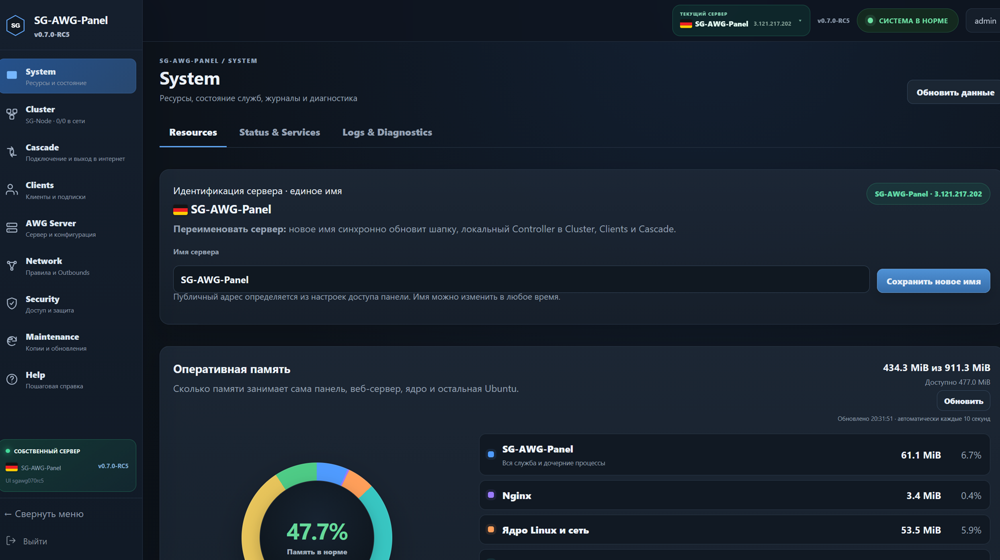
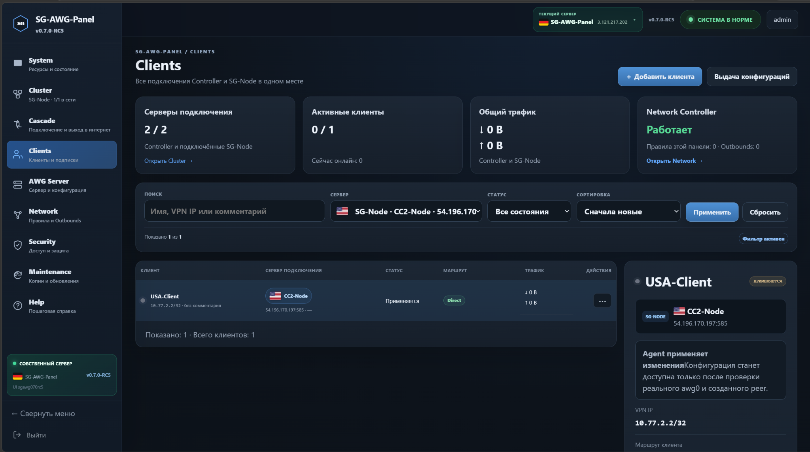
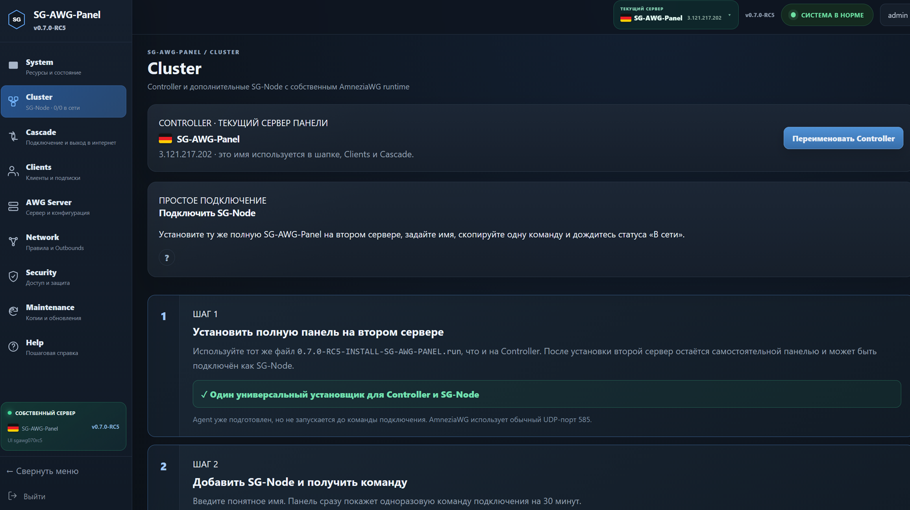
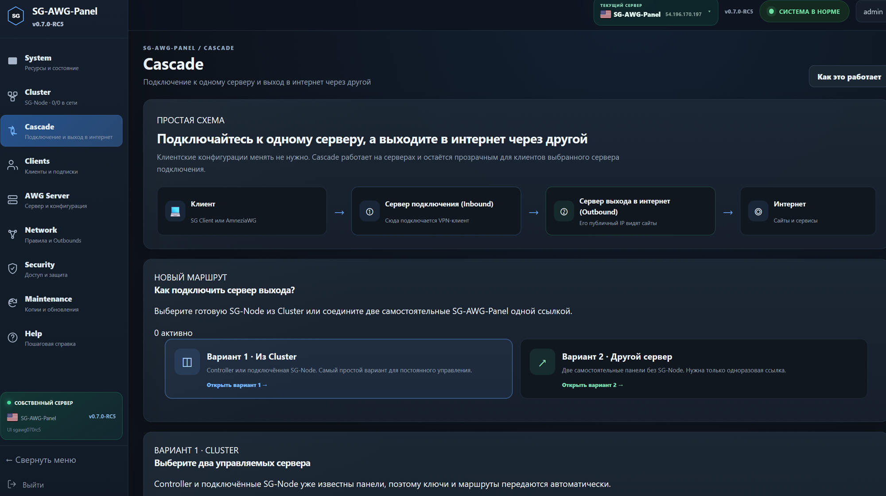
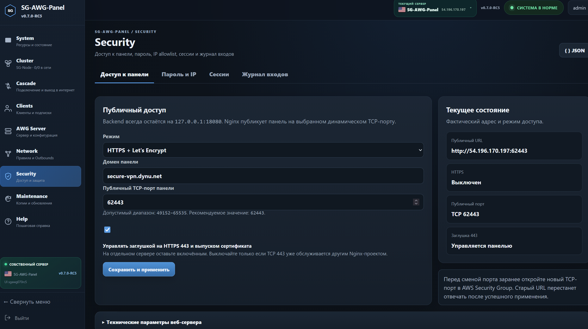
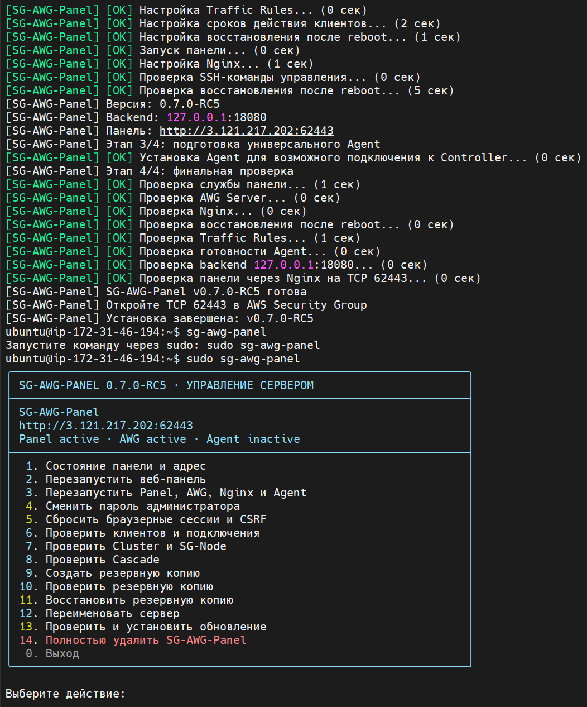

# SG-AWG-Panel

**Самостоятельная веб-панель для установки и управления AmneziaWG 2.0 на одном или нескольких Ubuntu-серверах.**


SG-AWG-Panel решает одну конкретную задачу: ставит на чистый Ubuntu-сервер нативный AmneziaWG 2.0 и даёт понятное управление сервером, клиентами, SG-Node, Cascade, Traffic Rules, безопасностью, резервными копиями и обновлениями.

```text
Обычный маршрут: Client → AWG Server → Internet
Cascade:        Client → Entry SG-AWG → Exit SG-AWG → Internet
Cluster:        Controller → SG-Node Agent → AmneziaWG runtime
```

Пользовательский трафик проходит через AmneziaWG напрямую. Xray, VLESS, Reality и отдельная прокси-цепочка для работы соединения не требуются.

> Текущая версия: `v0.7.0-RC5` · GitHub build: `RC5 Build Fix 2`.

## Интерфейс RC5

<table>
<tr>
<td width="50%"></td>
<td width="50%"></td>
</tr>
<tr>
<td></td>
<td></td>
</tr>
</table>

<details><summary>Security и SSH-меню</summary>





</details>

## Главное в RC5

- постоянные отдельные VPN-пулы: Controller `10.77.0.0/24`, SG-Node 1–12 — `10.77.1.0/24` … `10.77.12.0/24`;
- автоматическая миграция существующих Node и их клиентов в назначенный пул;
- точная строка `AllowedIPs = 0.0.0.0/0, ::/0` для совместимости с раздельным туннелированием AmneziaVPN;
- единые резервные копии для веб-панели и SSH с manifest, SHA-256, SQLite `integrity_check` и обязательной проверкой;
- упрощённое SSH-меню без дублирующих пунктов и отдельное действие «Проверить резервную копию»;
- установка, обновление и полное удаление напрямую из GitHub `main`, без обязательного Release или тега;
- один полный установщик для Controller и SG-Node, один updater и скрытая аварийная команда `repair-access`;
- сохранены исправления CSRF, синхронизация реального ключа `awg0`, классический интерфейс и безопасные задания Agent;
- Build Fix 2 сохраняет созданную Cascade-ссылку на экране до истечения срока и принимает стандартный `::/0` в импортируемом IPv4 Outbound.

## Возможности

### AWG Server

- установка AmneziaWG и системных компонентов;
- создание и применение конфигурации сервера;
- Endpoint, UDP-порт, внутренняя сеть, DNS, MTU и параметры маскировки AmneziaWG;
- запуск, остановка и перезапуск AWG Server;
- просмотр фактических системных файлов без ручного редактирования.

### Clients

- отдельная пара ключей для каждого устройства;
- автоматическое назначение внутреннего IP;
- включение, отключение, срок действия и удаление;
- QR-код, копирование, `.conf` и защищённая персональная ссылка;
- локальные и удалённые клиенты в одном разделе;
- сервер подключения, фактический маршрут, handshake и трафик;
- профиль клиента SG-Node имеет обычный формат SG-AWG-Panel.

### Cluster и SG-Node

- один Controller и несколько SG-Node;
- один и тот же полный установщик на каждой EC2;
- подключение Node одной временной командой с enrollment token;
- команда показывается сразу после добавления или повторного подключения;
- heartbeat, адрес, версия Agent, службы, CPU, RAM, диск и load average;
- отсутствие произвольного remote shell;
- безопасные задания Agent;
- синхронизация клиентов с реально работающим `awg0`;
- отдельное обновление подключения Node без удаления и повторного enrollment;
- автоматическое обновление статуса удалённого клиента до «Активен»;
- сохранение локальных peers Node;
- защита от конфликтов ключей и VPN-адресов.

### Cascade

Поддерживаются два сценария:

1. Controller + SG-Node.
2. Две самостоятельные SG-AWG-Panel.

Панель умеет:

- создать служебный доступ на сервере выхода;
- проверить AWG outbound и policy routing;
- назначить Cascade выбранным клиентам;
- показать ожидаемый внешний IP выхода;
- отдельно проверить серверный маршрут и активное соединение клиента;
- применять Direct ↔ Cascade с точечной очисткой старых соединений клиента;
- вернуть Direct и полностью очистить внешний Cascade на обеих панелях.

### Traffic Rules

- домены, IPv4 и CIDR;
- TCP, UDP, порты и диапазоны портов;
- правила для всех или выбранных клиентов;
- приоритет, расписание и готовые списки;
- блокировка, обычный AWG Gateway или выбранный Outbound.

### Безопасность

- пароль администратора;
- уникальная браузерная сессия каждой установленной панели;
- CSRF-защита без сырой ошибки `Bad Request` при устаревшем токене;
- IP allowlist;
- активные сессии и их завершение;
- журнал попыток входа;
- backend только на `127.0.0.1:18080`;
- публичный доступ через Nginx;
- HTTP или HTTPS с Let’s Encrypt.

## SSH-меню администратора

После установки выполните:

```bash
sudo sg-awg-panel
```

Откроется единое меню:

```text
 1. Состояние панели и адрес
 2. Перезапустить веб-панель
 3. Перезапустить Panel, AWG, Nginx и Agent
 4. Сменить пароль администратора
 5. Сбросить браузерные сессии и CSRF
 6. Проверить клиентов и подключения
 7. Проверить Cluster и SG-Node
 8. Проверить Cascade
 9. Создать резервную копию
10. Проверить резервную копию
11. Восстановить резервную копию
12. Переименовать сервер
13. Проверить и установить обновление
14. Полностью удалить SG-AWG-Panel
 0. Выход
```

Основные действия также доступны напрямую:

```bash
sudo sg-awg-panel status
sudo sg-awg-panel password
sudo sg-awg-panel sessions
sudo sg-awg-panel clients
sudo sg-awg-panel cluster
sudo sg-awg-panel cascade
sudo sg-awg-panel verify-backup
```

## Требования

- отдельный сервер или EC2;
- Ubuntu Server `22.04 LTS` или `24.04 LTS`;
- архитектура `amd64`;
- root или `sudo`;
- TCP `22` для SSH;
- один свободный TCP-порт панели из диапазона `49152–65535`;
- UDP-порт AmneziaWG, по умолчанию `585`;
- для HTTPS — TCP `80`, TCP `443` и выбранный порт панели.

Установщик и полный uninstall рассчитаны на выделенный сервер, где AmneziaWG, Nginx и Certbot не обслуживают другие проекты.

## Установка прямо из GitHub main

На чистой Ubuntu 22.04/24.04:

```bash
curl -fsSL https://raw.githubusercontent.com/s-gor/sg-awg-panel/main/install.sh -o /tmp/install-sg-awg-panel.sh
sudo bash /tmp/install-sg-awg-panel.sh
```

Установщик проверяет TCP `18080`, выбранный публичный TCP-порт и стандартный UDP `585`, затем скачивает полное текущее дерево `main`.

## Рекомендуемая установка на новую EC2 без unzip

На Controller и на будущей SG-Node используется один и тот же файл:

```text
0.7.0-RC5-INSTALL-SG-AWG-PANEL.run
```

Запуск:

```bash
sudo bash 0.7.0-RC5-INSTALL-SG-AWG-PANEL.run
```

`unzip`, предварительный `apt install`, Git и отдельный Node installer не требуются. Установщик показывает этапы, зелёную вертушку и время, а технический вывод пишет в журнал:

```text
/var/log/sg-awg-panel-install.log
```

На второй EC2 запустите **тот же файл**:

```bash
sudo bash 0.7.0-RC5-INSTALL-SG-AWG-PANEL.run
```

Обе панели сначала самостоятельны. Затем в разделе Cluster выберите Controller и выполните показанную команду подключения на второй панели.

## Установка из ZIP

```bash
unzip 0.7.0-RC5-AWG-Panel.zip
cd 0.7.0-RC5-AWG-Panel
sudo bash install.sh
```

## Первый вход

После установки откройте:

```text
http://PUBLIC_IP:ВЫБРАННЫЙ_ПОРТ
```

Например:

```text
http://203.0.113.10:62443
```

При проблеме со входом или CSRF:

```bash
sudo sg-awg-panel repair-access
```

## Обновление

Для обеих EC2 используется один updater:

```bash
sudo bash 0.7.0-RC5-UPDATE-SG-AWG-PANEL.run
```

Из распакованного ZIP:

```bash
unzip 0.7.0-RC5-AWG-Panel.zip
cd 0.7.0-RC5-AWG-Panel
sudo bash update.sh
```

Updater создаёт страховочную копию, сохраняет Clients, ключи, Cluster, Cascade, настройки и подключение Agent. При ошибке выполняется автоматический откат.

Обновление также доступно в `Maintenance → Updates` и через пункт 13 SSH-меню.

## Полное удаление

Из установленной панели:

```bash
sudo sg-awg-panel uninstall
```

Или напрямую из GitHub:

```bash
curl -fsSL https://raw.githubusercontent.com/s-gor/sg-awg-panel/main/uninstall.sh | sudo bash
```

Подтверждение:

```text
DELETE SG-AWG-PANEL COMPLETELY
```

После удаления:

```bash
sudo reboot
```

## Скриншоты RC5

После финального live-теста изображения добавляются в `docs/screenshots/`. Подготовлены единые имена и размеры для System, Clients, Cluster, Cascade, SSH-меню и установщика. См. [инструкцию для скриншотов](docs/screenshots/README.md).

## Документация

- [Руководство пользователя](docs/USER-GUIDE.md)
- [Установка](docs/INSTALLATION.md)
- [Clients](docs/CLIENTS.md)
- [AWG Server](docs/SERVER.md)
- [Traffic Rules](docs/TRAFFIC-RULES.md)
- [Cascade](docs/CASCADE.md)
- [Cluster и SG-Node](docs/MULTI-NODE.md)
- [Встроенная Help](docs/HELP.md)
- [JSON и System Files](docs/CONFIG.md)
- [HTTPS](docs/HTTPS.md)
- [Security](docs/SECURITY.md)
- [Maintenance и SSH-меню](docs/MAINTENANCE.md)
- [Диагностика](docs/DIAGNOSTICS.md)
- [Удаление](docs/UNINSTALL.md)

## Статус релиза

`0.7.0-RC5` — Release Candidate. Перед постоянным использованием рекомендуется живой прогон на двух чистых EC2:

1. одинаковая установка на обе EC2;
2. локальный клиент на каждой панели;
3. подключение одной панели как SG-Node;
4. клиент Node через Controller;
5. отсутствие повторяющихся VPN-адресов;
6. обычный маршрут и Cascade;
7. updater;
8. SSH-меню;
9. полный uninstall.

## Ответственность

Используйте проект в соответствии с законодательством вашей страны и правилами провайдера. Перед установкой на сервер с другими сервисами изучите действия installer, updater и uninstall.
